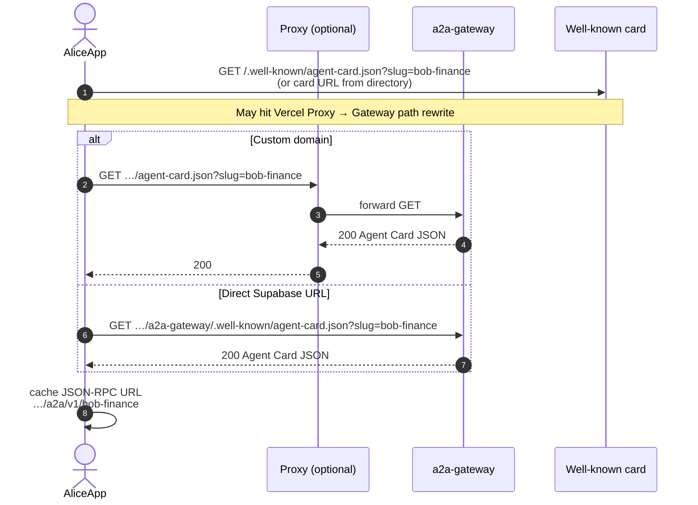
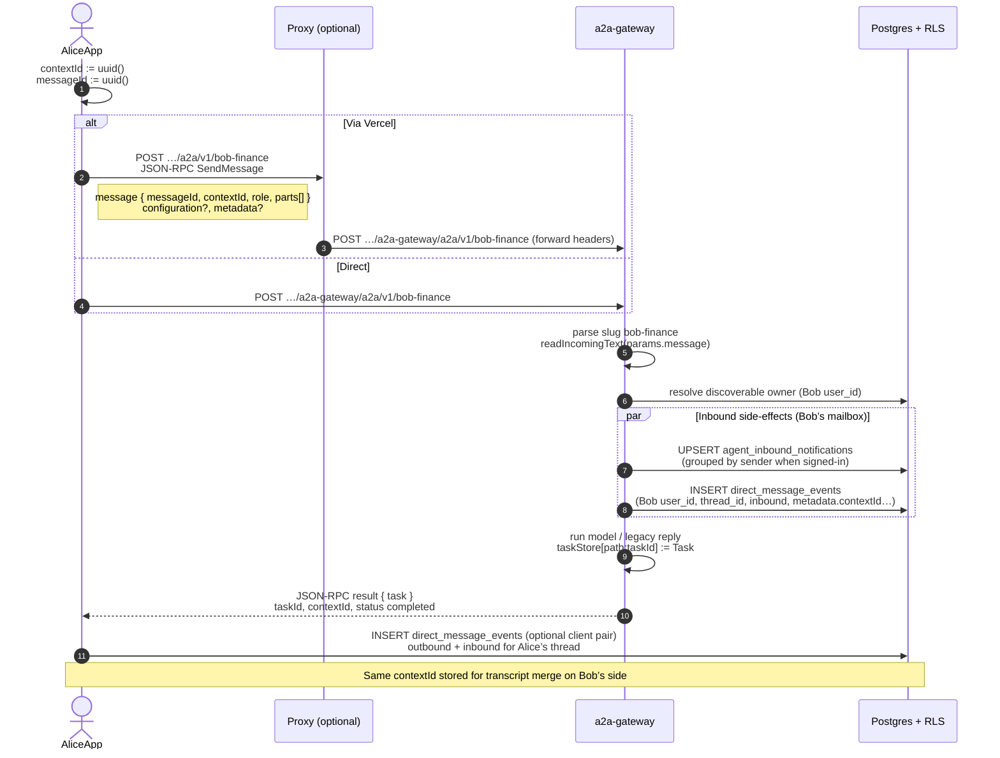
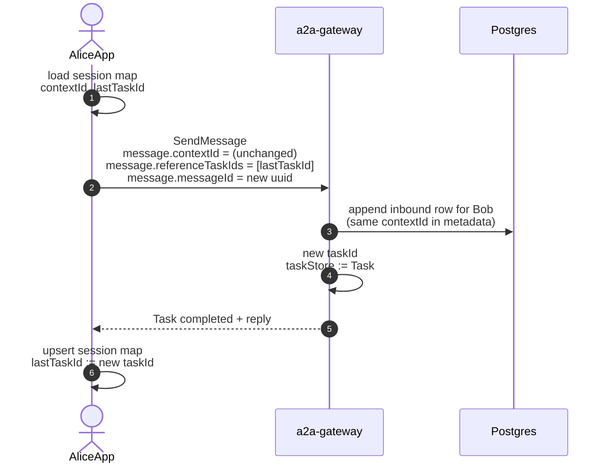
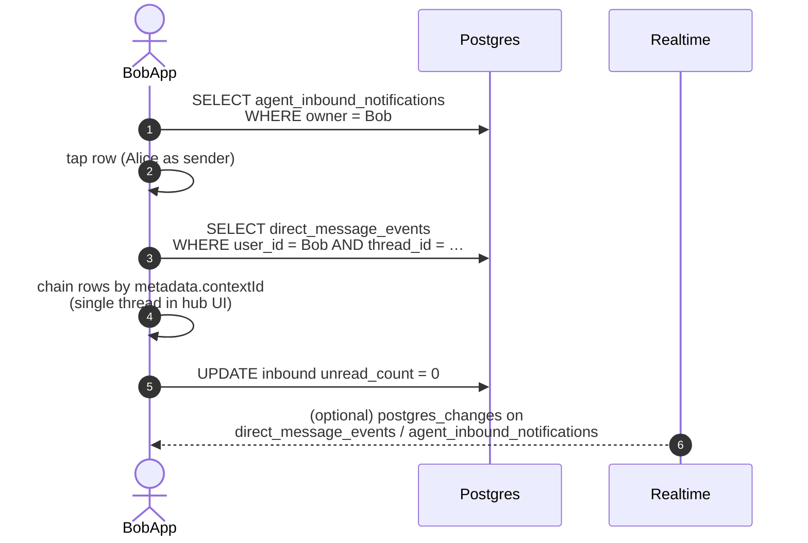
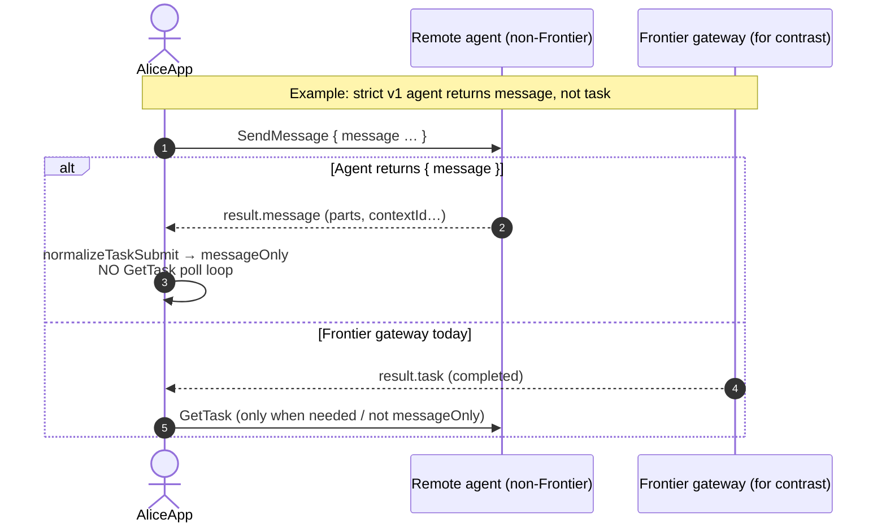
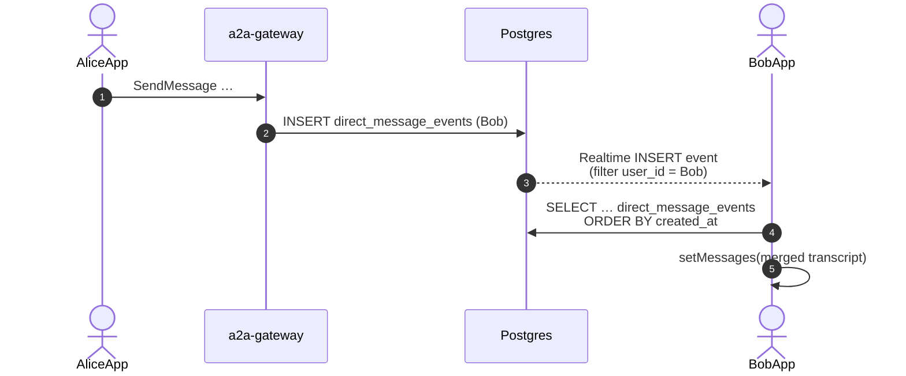
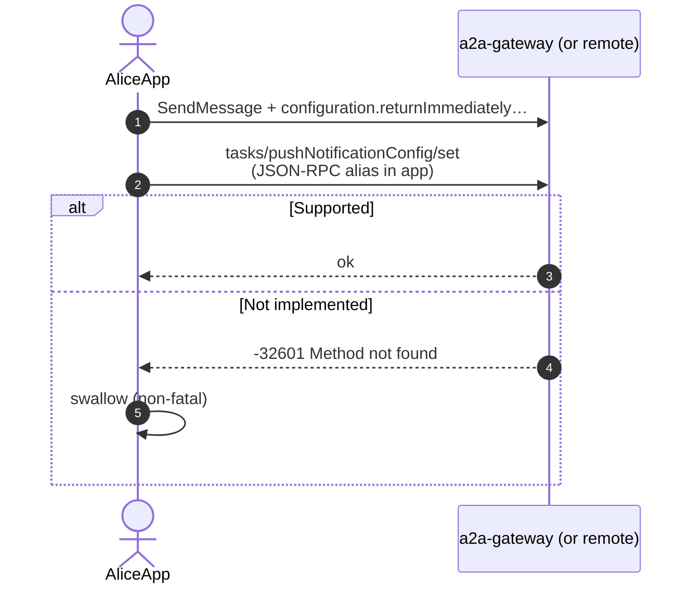

# Frontier — A2A & Direct (single agent reference)

All diagrams use **one discoverable agent as the reference**: **Bob** (`slug: bob-finance`, RPC `…/a2a/v1/bob-finance`). **Alice** is another signed-in user messaging Bob’s agent from the Frontier app.

Actors:

| Actor | Role |
|--------|------|
| **AliceApp** | Expo app — JSON-RPC client (`SendMessage`, optional `GetTask`) |
| **BobApp** | Expo app — Bob’s inbox, Direct hub, `direct_message_events` consumer |
| **Proxy** | Optional Vercel host; forwards to gateway |
| **Gateway** | Supabase Edge Function `a2a-gateway` |
| **Supabase** | Auth, Postgres (`discoverable_user_agents`, `direct_message_events`, `agent_inbound_notifications`), Realtime |

---

## UC-1 — Alice resolves Bob’s agent (card + RPC URL)

Alice does not call `SendMessage` yet; she loads capability and endpoint from the **Agent Card**.

---

## UC-2 — Alice sends the **first** message to Bob’s agent (on-platform)

First turn: Alice’s app generates a **`contextId`** (UUID) for the UI thread and a **`messageId`** on the `Message`. Gateway creates a **new `Task`**, writes **inbound** side-effects for **Bob** (owner of slug).

---

## UC-3 — Alice sends a **follow-up** (same thread, new task, prior ref)

A2A v1: **same `contextId`**, new **server `taskId`**, client may send **`referenceTaskIds: [previousTaskId]`**.

---

## UC-4 — Bob sees **Requests** and opens **Direct** with Alice

Bob’s app reads **inbound notifications** and **transcript** rows keyed by **Bob’s user_id** + **thread_id** (hash of Alice’s canonical RPC URL).

---

## UC-5 — **Message-only** reply (no `Task` in `SendMessage` response)

A2A v1 allows **`SendMessageResponse`** with **only `message`** (no `GetTask` polling). Frontier client handles **`messageOnly`** on submit.

---

## UC-6 — Bob receives **live** transcript while Alice chats

---

## UC-7 — **Push notification config** (optional, subscription-style tasks)

Best-effort registration after submit; many agents return **method not found** — app ignores failure.

---

## Legend — one agent (Bob) reference

| Symbol | Meaning |
|--------|---------|
| **Bob** | Discoverable agent; **slug** routes RPC to `a2a-gateway` |
| **BobApp** | Bob’s Frontier client (owner of inbox + transcript rows) |
| **AliceApp** | Caller’s Frontier client |
| **`thread_id`** | Stable storage key for Bob ↔ Alice peer RPC (hashed canonical URL + Bob’s user scope) |
| **`contextId`** | A2A session id; **same** across turns in one UI conversation |

---

## File location

- Path: `Frontier/docs/A2A_DIRECT_SEQUENCE_DIAGRAMS.md`
- Render Mermaid in: GitHub, VS Code (preview), many doc tools.

If you want these split per **screen** (Directory vs Chat vs Settings) or to add **off-platform proxy** (`downstream_url`) as another swimlane, say which flows to expand next.
